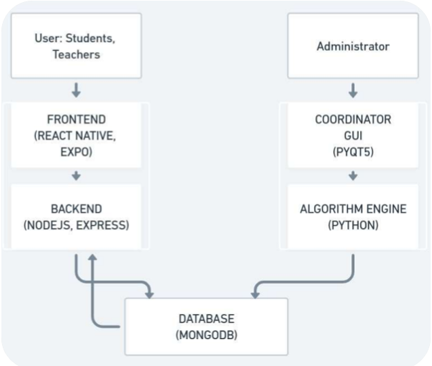

# 📘 An-Automated-University-Timetable-Generator-Using-Heuristic-Approach

This project aims to automate the generation of university timetables using a heuristic-based algorithm. It streamlines scheduling by factoring in course requirements, faculty availability, and institutional constraints, providing an efficient, scalable, and user-friendly solution.

---

## 🧩 System Architecture

The system is divided into two main interaction modules:

### 👩‍🏫 User Interface (Students and Teachers)

* **Frontend**: Built with **React Native + Expo** to ensure a cross-platform mobile experience.
* **Backend**: Powered by **Node.js + Express**, which handles API requests and communication with the database.
* **Database**: **MongoDB** is used to store timetables, user information, and preferences.

### 🛠️ Administrator Panel

* **Coordinator GUI**: Developed using **PyQt5**, allows administrators to manage scheduling parameters.
* **Algorithm Engine**: Implemented in **Python**, this module uses a heuristic-based approach to generate optimized timetables.
* **Database**: Communicates with MongoDB for reading constraints and saving the generated schedules.

---

## ⚙️ Key Features

* 📱 Mobile App Interface for Students and Faculty
* 🧠 Heuristic Algorithm for Efficient Timetable Generation
* 🧑‍💼 GUI for Admins to Input Constraints
* 📊 Persistent Storage using MongoDB
* 🔄 Real-time Updates and User Access to Personalized Timetables

---

## 🛠️ Tech Stack

| Component        | Technology         |
| ---------------- | ------------------ |
| Frontend         | React Native, Expo |
| Backend API      | Node.js, Express   |
| Admin GUI        | PyQt5              |
| Algorithm Engine | Python             |
| Database         | MongoDB            |

---

## 🧮 Heuristic Algorithm Highlights

* Multi-constraint handling (faculty availability, subject hours, room limits)
* Collision detection and resolution
* Preference-based assignment (e.g., preferred teaching slots)
* Scalable design for large department/course loads

---

## 🚀 Getting Started

### Prerequisites

* Node.js
* Python 3.8+
* MongoDB
* Expo CLI (for React Native)
* PyQt5

### Installation Steps

1. **Clone the Repository**

   ```bash
   git clone https://github.com/yourusername/An-automated-university-timetable-generator-using-heuristic-approach.git
   cd An-automated-university-timetable-generator-using-heuristic-approach
   ```

2. **Backend Setup (Node.js + Express)**

   ```bash
   cd university-timetable-mobile-application\server
   npm install
   npm start
   ```

3. **Frontend Setup (React Native + Expo)**

   ```bash
   cd university-timetable-mobile-application\client
   npm install
   expo start
   ```

4. **Algorithm Engine Setup and Coordinator GUI (Python & PyQt5)**

   ```bash
   cd university-timetable-generator-with-gui
   pip install -r requirements.txt
   python ui_controller.py
   ```

---

## 📸 System Flow Diagram


---

## 🤝 Contributions

We welcome contributions! Please fork the repository and create a pull request.

---

## 📄 License

This project is licensed under the MIT License.

---
